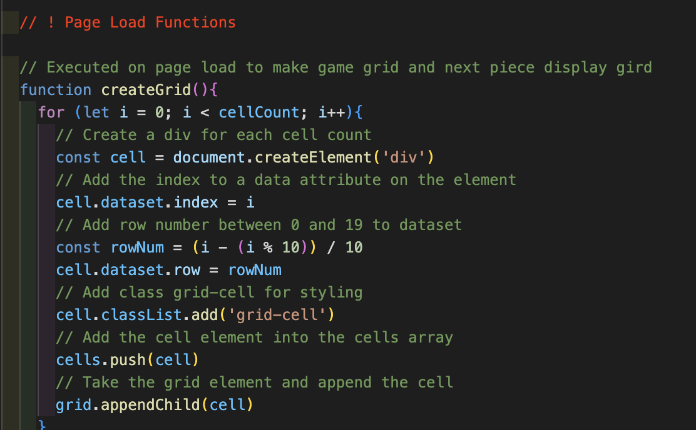
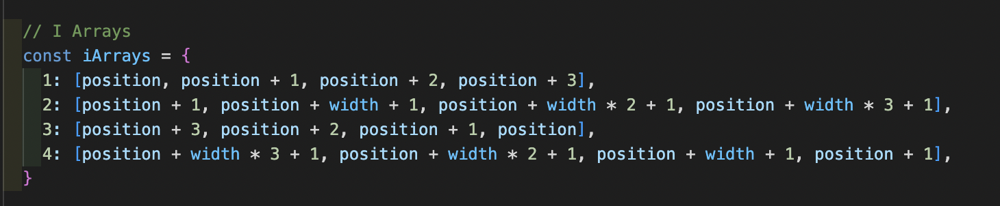
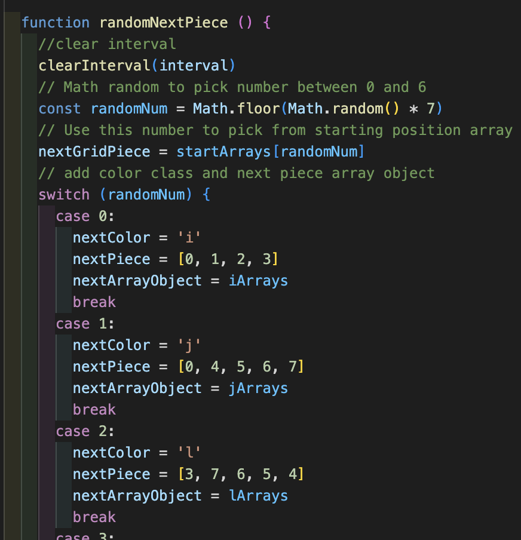
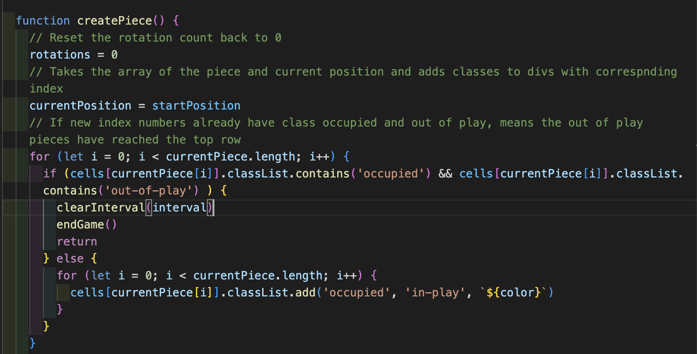
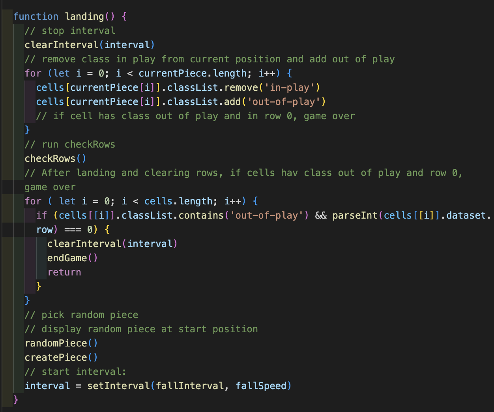
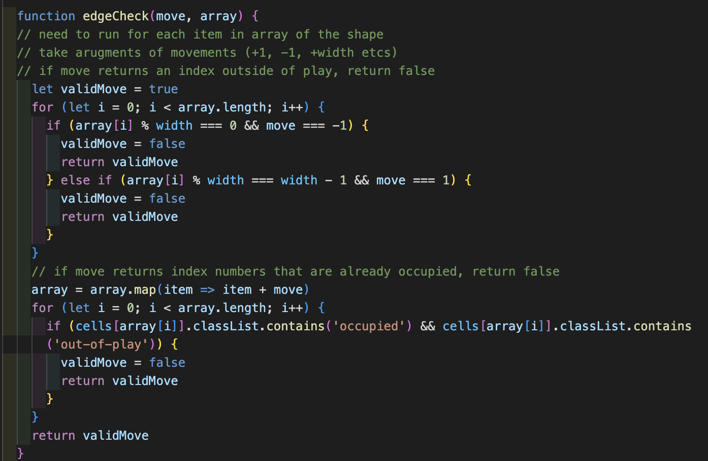
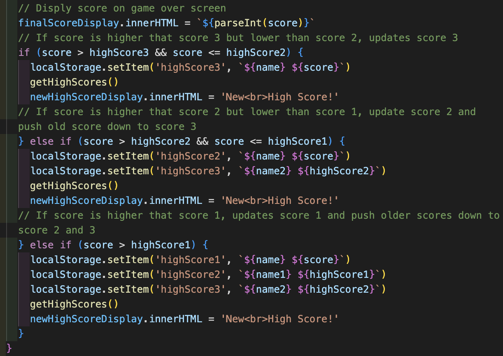
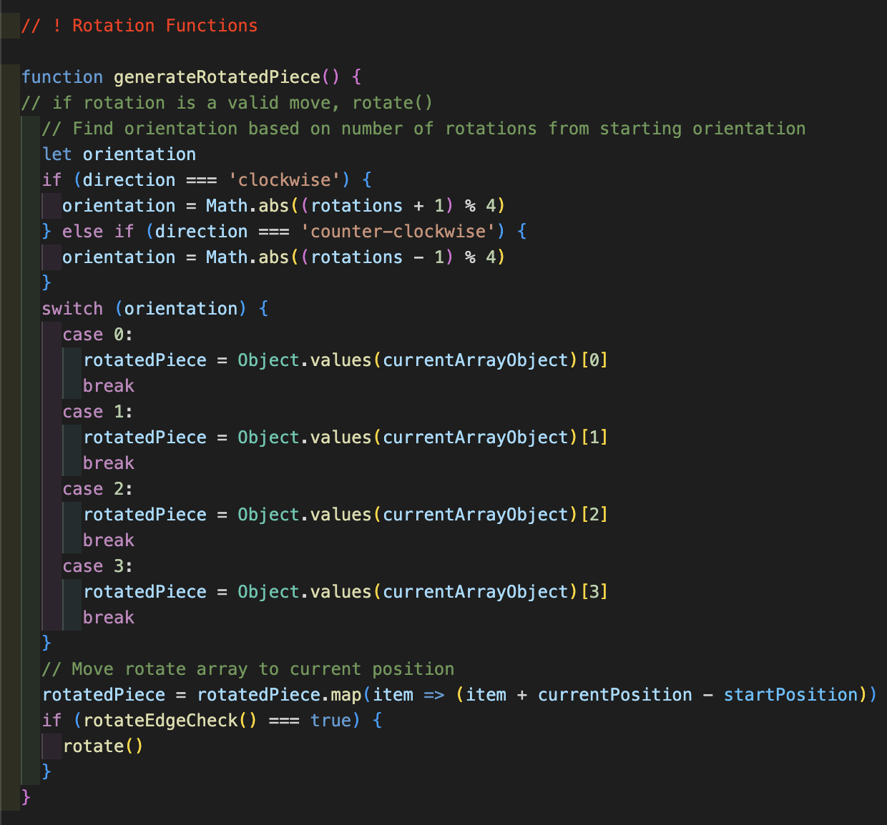
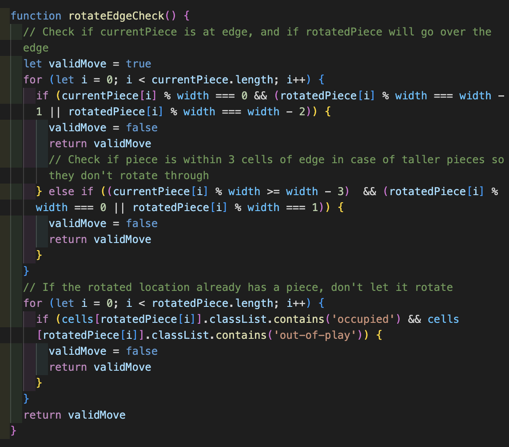
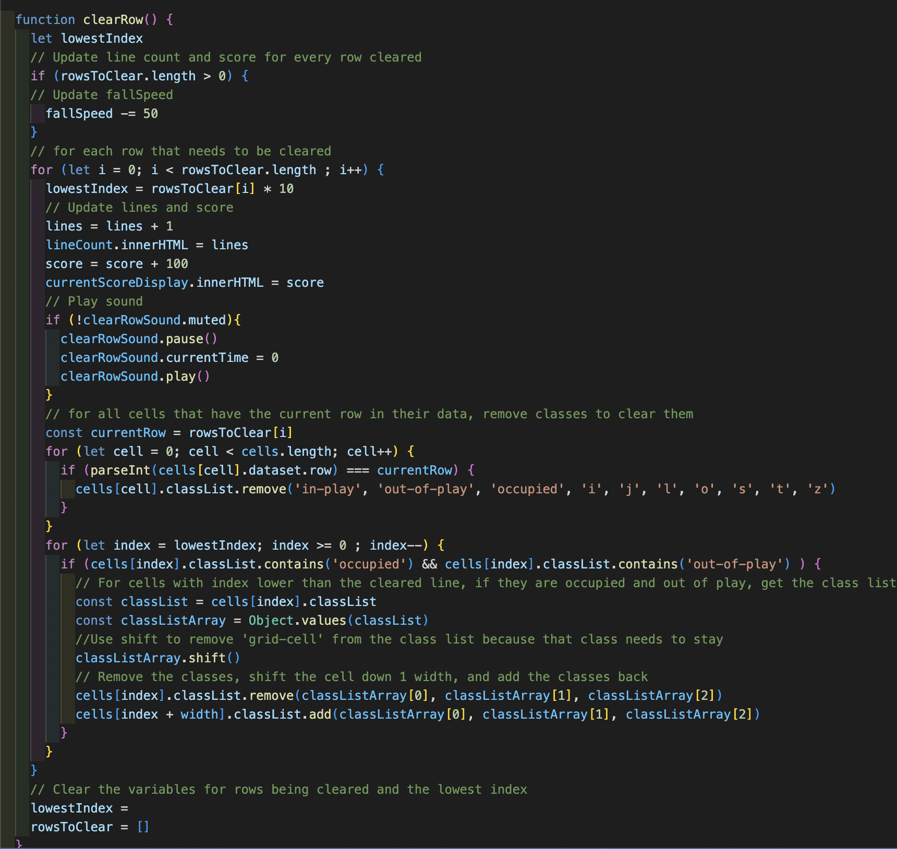

# SEI Project One, Tetris Clone: A Browser-Based JavaScript Game

# Table of contents
* [Project Overview](#project-overview)
* [Deployment Link](#deployment-link)
* [Timeframe](#timeframe) 
* [Technologies Used](#technologies-used)
* [Brief](#brief) 
* [Planning](#planning)
* [Build Process](#build-process)
* [Challenges](#challenges)
* [Wins](#wins)
* [Key Learnings](#key-learnings)
* [Bugs](#bugs)
* [Future Improvements](#future-improvements) 

# Project Overview

This was the first project I did for a Software Engineering Immersive course through General Assembly London. It is a grid-based game built using JavaScript, HTML and CSS based on the classic arcade game Tetris.

# Deployment Link

The game has been deployed with GitHub pages and is available [here.](https://kdshea.github.io/Tetris-Clone/)

# Timeframe

* Solo project completed over one week

# Technologies Used 

* JavaScript
* CSS3
* HTML5
* GitHub Pages
* Chrome Developer Tools
* Excalidraw

# Brief
 * Requirements:
   *  The game should stop if a Tetrimino fills the highest row of the game board
   * The player should be able to rotate each Tetrimino about its own axis
   * If a line is completed it should be removed and the pieces above should take its place

 * Suggested Enhancements:
   * Responsive design
   * Speed increases over time
   * Persistent leaderboard using localStorage

# Planning

* I spent an entire day planning, and it made the workflow for the rest of the week really smooth. Based on the project brief, I defined the minimum viable product and extra stretch goals. I found a classic version of Tetris and took screenshots. I used them as references along with Excalidraw to make wireframe sketches of what the game should look like at different stages of play.

 * Minimum Viable Product (MVP): 
   * Pieces move down at an interval
   * User can rotate pieces
   * User can move pieces L and R
   * Pieces stack on bottom of grid
   * Randomly selects next piece
   * Full row clears the row, other pieces move down
   * Filling to top row ends the game
   * Score and line count go up with each cleared row
   * Functional start, pause, resume, and quit buttons

 * Stretch Goals:
   * Display upcoming piece
   * High scores with name and local storage
   * User can drop pieces faster
   * "Ghost" piece to show where it will land
   * Interval of fall speeds up as rows are cleared
   * Rotate buttons for clockwise and counterclockwise

* I wrote out detailed plans and pseudocode for the HTML and CSS content I needed, buttons and game controls, the game board, the Tetris pieces and their rotations, different kinds of movement on click events and time intervals, and behavior for landing and clearing rows. 

* Below, I’ve included all the wireframes and pseudocode that went into planning. It is incredibly detailed because this was when I was figuring out the logic of how movement in the game would work. For the sake of time, I won't be offended if you skip straight to my [Build Process](#build-process). 

 ## Wireframes

 * Start 
	 * At start of game: disable pause button, empty inner score and linen count and next shape, clear next piece grid

  

 * Play
	 * During game play: disable start button

  

 * Paused
 	* When game is paused: disable start and pause

  

 * End of Game
	 * At end of game: hide start and pause buttons, add a play again button under final score, display if new high score in another span, clear next piece grid

  

## Pseudocode

 * HTML
   * Start button, pause button, current score span, high score span, lines completed span, small grid to display next piece, grid for game
   * Grid divs will be generated using JavaScript

 * CSS
   * Classes for:
    * cells occupied by a piece (in play or out of play)
    * cells that are part of piece in-play
    * cells that are stacked and out-of-play
    * each type of piece for corresponding color

 * Controls
   * Left arrow for Left
   * Right arrow for Right
   * Q for rotate clockwise
    * Possibly W for rotate counter-clockwise
    * Possibly Down arrow to drop faster
   * Start, pause, resume, and quit using on screen buttons

  

 * Grid
 	* Each cell on the grid is a div
		

  

 * Pieces
   * Arrays containing each piece and its rotations
   * Example for "T" piece starting position array calculated using the top left corner as the reference position

	* [position + 1,   position + width,   position + width + 1,   position + width + 2]

  

 * Complete Diagram of Pieces and Rotations

  

 * Random Piece Selection
   * Object containing the arrays of the 7 possible pieces in their starting orientations
   * Add class “occupied” to each grid box the shape takes up
   * Math.random to select a new piece

* Left and Right Movement
   * Click events to add 1 or subtract 1 from the index numbers of cells occupied by the piece in-play

* Falling Movement
   * Start pieces from starting reference position at the top middle of the board (index 3) and fill other cells relative to that one
   * setInterval to add the board width to the index numbers of cells occupied by the piece in-play – this shifts the cells down 1 row

* Rotation Movement
   * During game play, keep track of current reference position by adding interval and L and R movements to it
   * On rotation, remove class from current in-play cells and add to new cells using the rotation array values calculated from the current reference point
   * Have a variable for how many rotations from start it has done to calculate which array version to use for the new cells. Number of rotations % 4 = 0 would bring back to the starting position

* Edge Behavior
   * Don't allow rotations or left or right movements if doing so would require a cell at index % 10 = 0 to go left or a cell at index % 10 = 9 to go right
   * Don't add/remove any classes and don't change the current reference position 

* Landing 
   * Stop interval if the piece reaches the bottom of the grid (i.e. if the index of the next cell is between 190 and 199) OR if the index of would-be next cell already has classes “occupied” and “out-of-play”
   * Clear interval, remove class in play from active piece and add class out of play

* Clearing a Row
   * If all cells between index % 10 = 0 and index % 10 = 9 of the same row have class “occupied”, clear the row
   * Remove classes “occupied”, “in-play”, and “out-of-play” from all the cells of that row

* Moving Rows Following a Clear
   * After a row is cleared, add + width to all the occupied cells with an index lower than the lowest index of that row

* Filling Highest Row (End Game)
   * If a cell has class out-of-play AND index between 0 and 9, the game is over
   * Stop interval
   * Clear grid, removing all occupied classes and in-play or out-of-play
   * Display game over div and final score

* Start Button
   * Take input from name span
   * Removes Tetris div and name div
   * Selects random piece
   * Adds class to cells to display piece
   * Starts interval to fall

* Pause Button
   * Stops interval
   * Hides game grid
   * Shows paused div, resume, and quit buttons

* Resume Button
   * Hides paused div, resume, and quit buttons
   * Starts fall interval

* Quit Button
   * Clears grid, removing all occupied classes and in-play or out-of-play
   * Reset score and line count
   * Display start div and name input span

* Play Again Button
   * Clear game over screen
   * Back to start screen

* Name Input and High Score Local Storage
   * On page load, get high score info and display in HTML
   * At the end of the game and when quitting the game, check if the current score is greater than the high score. Update high score with name and new score value

# Build Process

## Day 1

* The project was introduced and I brainstormed some initial ideas of what the project goals and challenges would be. I spent the first day working on ideas, wireframes, and pseudocode that is detailed above in the [Planning](#planning) section.

## Day 2

* I dove into coding, writing out some HTML to make a container for the game board and a createGrid function to generate the game board divs dynamically when the page loads. For each div, I added a data attribute for what row the div is in as well as  a data attribute of its index number.
* I made variables in JavaScript to target all the DOM elements I would need to use in later functions.
* There are 7 shapes in Tetris represented by the letters I, O, T, S, Z, J, and L. I used a reference point on the game grid called "position" and made an array for each piece that would calculate what index number cells would be occupied by the Tetris piece if it started at the index number of the reference position. I repeated this for each possible orientation the shape could have when it was rotated. 

  

* Later in the week, I ended up coming back and putting the arrays together into objects where the keys were 1, 2, 3, 4 and their values were the position arrays that rotated 90 degrees each time. The starting orientation is the array of key 1, and the starting position is index number 4 (top and center of the board).

  

* I wrote out more detailed pseudocode for all the JavaScript functions that I would need to code for the game and put them in the order that I should write them in so I could test them as I worked.

## Day 3

* I wrote out click events for all the on-screen buttons and keyboard controls.
* I worked on JavaScript functions for the rest of the day
	* Starting game:
      * Clear the old interval, pick a random game piece, and create the piece on the grid, set the new interval
	* Selecting a random piece:
      * Randomly selecting a number between 0 and 6, to select the piece from an array of the possible starting pieces, use a swtich block to set the class for the color and the object of position arrays to use for rotating
    
  

	* Creating piece:
      * Take the array of the randomly selected game piece and add classes 'occupied', 'in-play' and the correct color to the cells with the index numbers for that piece calculated from the starting position
      
  

	* Landing Check and Landing
      * Before moving the piece one more width down, check if the new index numbers are outside of the board (meaning the piece reached the bottom) or if the new index numbers are already occupied.
      * If the piece is landing, remove class 'in-play' and add 'out-of-play'. Then, call the randomPiece and createPiece functions and start a new fall interval.

          
  

	* Fall interval
      * If the landingCheck function returned false, the movePiece function is called to shift the piece down one row. If the landingCheck returned true, then the landing function is called. The fallInterval function is triggered at a set interval that is started at the start of the game, then restarted each time a new piece is created.

	* Edge check
      * If the piece is on the left edge (index % width of the board === 0) and the user is trying to move left ( move === -1), then it is not a valid move. Also, the same logic applies if the piece is on the right edge (index % width === width - 1) and the user is trying to move right (move === 1). If the user tries to move to an index that has the classes 'occupied' and 'out-of-play', that would also return an invalid move.

    
  

	* Move piece
      * If the edgeCheck function returned that the move was valid, then the movePiece function would remove the 'occupied'. 'in-play', and color classes from the old position, shift the index numbers of the current piece, and add the classes to those cells. 

	* End game
      * When the game ends, the grid is cleared and all the variables are reset. 

## Day 4

* Clearing rows and rotating pieces were 2 of the functions that were a little more complex and had to be broken down. 

* In the [Challenges](#challenges) section, I described the code to clear complete rows with some example code. Clearing a row included:
	* Checking for full rows
	* Removing classes to clear them
	* Changing score and line count
	* If clearing multiple rows, moving cells down the appropriate number

* In the [Wins](#wins) section, I went into detail about the functions for rotating game pieces. Rotating a piece included:
	* Keeping track of the number of rotations
	* Selecting the appropriate positional array of the new rotation
	* Checking the edges to make sure the new rotation is possible
* I added a function to take the name input from the beginning of the game and add it with a high score to local storage. 

## Day 5

* The majority of this day was dedicated to styling. I wrote CSS for the shapes and their colors, the grids, buttons, fonts, text effects, graphics, and backgrounds. 
* I added some code so that when a row is cleared, the game is sped up by decreasing the setInterval of the falling pieces.

## Day 6

* I was happy to have completed an MVP, so I finished styling and spent most of this day working on stretch goals. I finished up the CSS I had worked on the day before to get a nice looking product. I added a favicon. I also added an info screen with game controls and functions to hide and display it. 
*  I edited the HTML to make 3 high score display spots. I wrote a getHighScore function that would get the 3 high scores from local storage to display on the page load. I added to the endGame function so that it would check the final score, and if it was higher than the high scores in storage it would update the local storage. 

    
  

*  I added a function to rotate counter-clockwise. I fixed a bug in the edge behavior for rotations of the right side for the I, L, T and S pieces.
*  I added to the createGrid function to make a smaller grid to the right of the game board to display the upcoming piece.

## Day 7

* I fixed a few bugs I had noticed:
	* There was trouble clearing non-consecutive rows.
	* Sometimes, when the top row was filled the game didn't end until a new piece was generated and overlapped with the top row. 

* Some last minute details I was able to add:
	* Start the game from hitting enter on keyboard
	* Hard drop piece by hitting space bar and prevent default behavior of space bar clicking buttons
	* Sounds on game over and when clearing a row
	* Buttons to turn sounds on and off
	* Hover and active effects for buttons
	* Added comments and explanations into JavaScript

# Wins 

* The rotation functionality was a personal win for me. Being able to rotate was one of the requirements of the MVP, and it was one of the trickier parts of the game to code.
* I defined a global variable of the number of rotations that started at 0. Each time a piece was rotated, 1 was added to the number of rotations. This number would be used to keep calculate the orientation. The calculation for a clockwise orientation would be  `orientation = Math.abs((rotations + 1) % 4)`. If there have been 7 rotations and we are rotating clockwise again, then the orientation equals 0 which brings us back to the original starting position. This makes sense because if we've rotated 45 degrees 8 times, we've done 2 full rotations. 
* This action was split into 3 separate functions. The first generateRotatedPiece function created an array of the rotated position, but doesn't change any 'occupied' or 'in-play' classes on the grid yet. The rotatedEdgeCheck function checks if this possible rotation is a valid move. If the move is valid, only then is the rotate function called and the 'occupied' and 'in-play' classes are removed from the current position and added to the new rotated position and 1 is added to the number of total rotations. 

* Generating the rotated piece
    
  

* Check the edges 

    
  

# Challenges

* Clearing rows was definitely a challenge because every time I thought I had it figured out, I would come across a bug later that I hadn't thought of before. At first, I wrote code that would only clear the bottom full row and move all the pieces above that down by one row. As I was testing the game, I realized that  there would be times that more than 1 row was cleared at a time and pieces above needed to be moved down by multiple rows. After I solved that issue, I was testing and realized that it was possible to need to clear non-consecutive rows. In that case, some pieces needed to move down only 1 row while others had to move down multiple. 
* My solution was to split it into 2 functions: one that checked each row to see if it was full and save those rows into a rowsToClear array. The next function iterated through that array of rows, clearing the rows one by one and moving only the pieces with index numbers higher than the row being cleared. 

    
  

# Key Learnings

* I really enjoyed working on this project and I'm proud of what I was able to come up with in a week. The biggest challenge here was working through the logic problems in JavaScript of moving with user input, moving with time intervals, checking for occupied spaces, clearing rows etc. I love puzzles and had a lot of fun with it, even when I ran into roadblocks or had to rethink my approach. I planned my project really well and knew everything I needed to do. The first day, I was a little worried that it was taking me so long to plan my project that I was going to run out of time to actually build everything. The early pseudocode I wrote actually made the work later so much smoother and I got things done faster than I anticipated. 

# Bugs

* The only bug that I've picked up on so far is that the first piece at the start of the game doesn’t rotate but all the following pieces will.

# Future Improvements

* Things that could be added in the future:
	* Some user feedback made me realize it would be a good idea to show the controls page after start, not just after clicking the info button. Some people were confused about how to rotate.
	* Break functions into smaller functions with parameters to reuse blocks of code that are somewhat similar (ex: inside edgeCheck() and rotatedEdgeCheck() or movePiece() and rotate())
	* Add variables to CSS for colors, fonts, borders etc.
	* CSS transition animation for pieces falling and hard drop
	* Ghost piece showing where current piece in play will land

