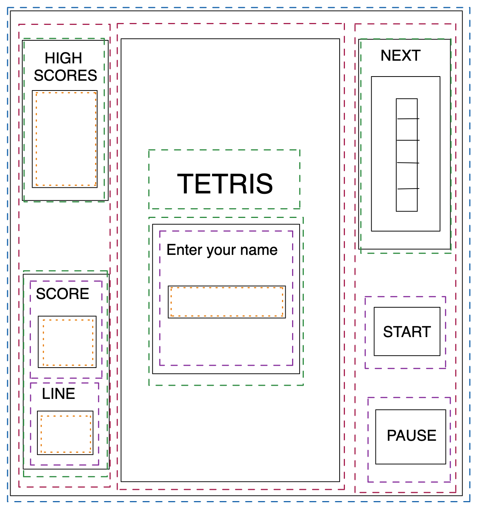
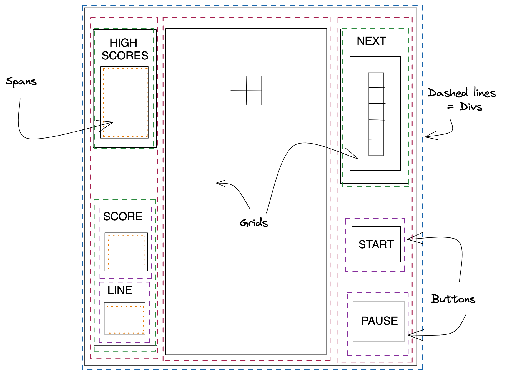
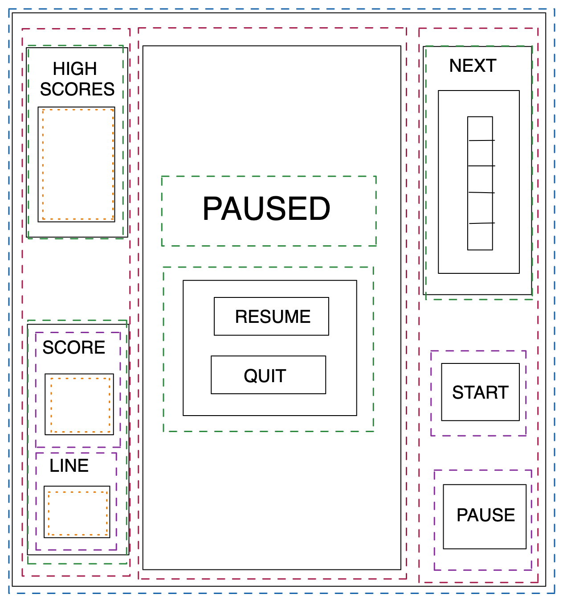
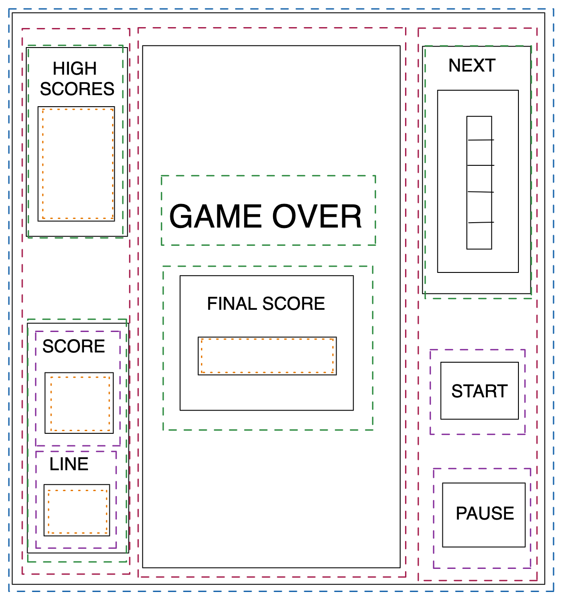
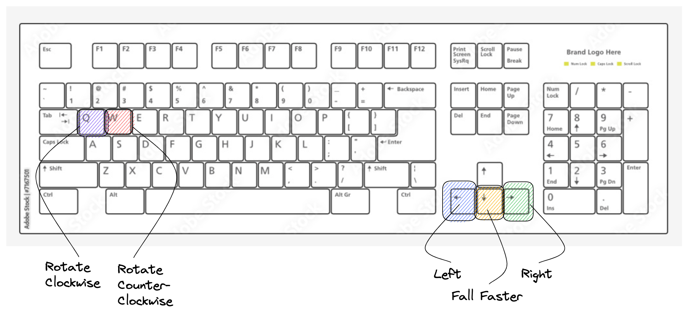
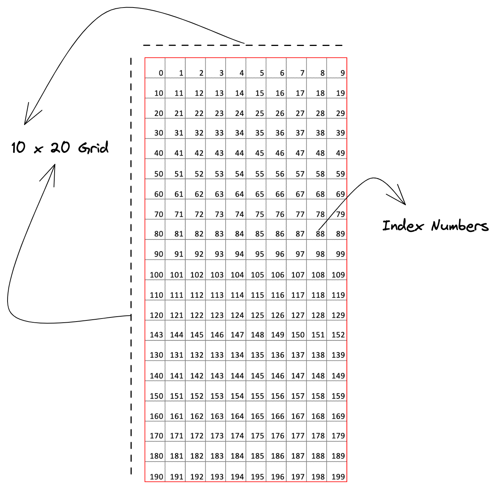
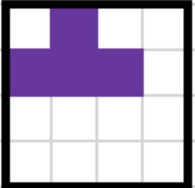
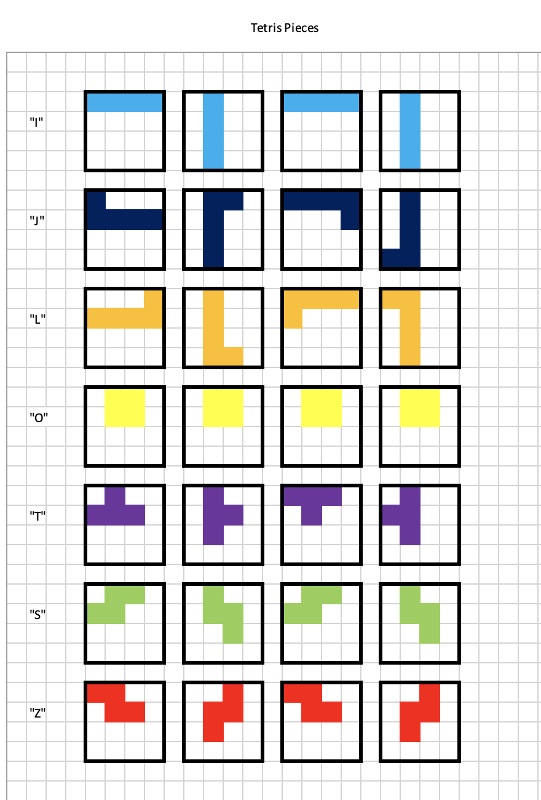

# SEI Project One, Tetris Clone: A Browser-Based JavaScript Game

# Table of contents
* [Project Overview](#project-overview)
* [Deployment Link](#deployment-link)
* [Timeframe](#timeframe) 
* [Technologies Used](#technologies-used)
* [Brief](#brief) 
* [Planning](#planning)
* [Build Process](#build-process)
* [Challenges](#challenges)
* [Wins](#wins)
* [Key Learnings](#key-learnings)
* [Bugs](#bugs)
* [Future Improvements](#future-improvements) 

# Project Overview

This was the first solo project I did for a Software Engineering Immersive course through General Assembly London. It is a grid-based game built using JavaScript, HTML and CSS based on the classic arcade game Tetris.

# Deployment Link

The game has been deployed with GitHub pages and is available [here.](https://kdshea.github.io/Tetris-Clone/)

# Timeframe

* Solo project completed over one week

# Technologies Used 

* JavaScript
* CSS3
* HTML5
* GitHub Pages
* Chrome Developer Tools
* Excalidraw

# Brief
 * Requirements:
   *  The game should stop if a Tetrimino fills the highest row of the game board
   * The player should be able to rotate each Tetrimino about its own axis
   * If a line is completed it should be removed and the pieces above should take its place

 * Suggested Enhancements:
   * Responsive design
   * Speed increases over time
   * Persistent leaderboard using localStorage

# Planning

* I spent an entire day planning, and it made the workflow for the rest of the week really smooth. Based on the project brief, I defined the minimum viable product and extra stretch goals. I found a classic version of Tetris and took screenshots. I used them as references along with Excalidraw to make wireframe sketches of what the game should look like at different stages of play.

 * Minimum Viable Product (MVP): 
   * Pieces move down at an interval
   * User can rotate pieces
   * User can move pieces L and R
   * Pieces stack on bottom of grid
   * Randomly selects next piece
   * Full row clears the row, other pieces move down
   * Filling to top row ends the game
   * Score and line count go up with each cleared row
   * Functional start, pause, resume, and quit buttons

 * Stretch Goals:
   * Display upcoming piece
   * High scores with name and local storage
   * User can drop pieces faster
   * "Ghost" piece to show where it will land
   * Interval of fall speeds up as rows are cleared
   * Rotate buttons for clockwise and counterclockwise

* I wrote out detailed plans and pseudocode for the HTML and CSS content I needed, buttons and game controls, the game board, the Tetris pieces and their rotations, different kinds of movement on click events and time intervals, and behavior for landing and clearing rows. 

* Below, I’ve included all the wireframes and pseudocode that went into planning. It is incredibly detailed because this was when I was figuring out how the logic of the movement and game would work. For the sake of time, I won't be offended if you skip straight to my [Build Process](#build-process). 

 ## Wireframes

 * Start 
	 * At start of game: disable pause button, empty inner score and linen count and next shape, clear next piece grid

 * Play
	 * During game play: disable start button

 * Paused
 	* When game is paused: disable start and pause

 * End of Game
	 * At end of game: hide start and pause buttons, add a play again button under final score, display if new high score in another span, clear next piece grid

## Pseudocode

 * HTML
   * Start button, pause button, current score span, high score span, lines completed span, small grid to display next piece, grid for game
   * Grid divs will be generated using JavaScript

 * CSS
   * Classes for:
    * cells occupied by a piece (in play or out of play)
    * cells that are part of piece in-play
    * cells that are stacked and out-of-play
    * each type of piece for corresponding color

 * Controls
   * Left arrow for Left
   * Right arrow for Right
   * Q for rotate clockwise
    * Possibly W for rotate counter-clockwise
    * Possibly Down arrow to drop faster
   * Start, pause, resume, and quit using on screen buttons

 * Grid
		

 * Pieces
   * Arrays containing each piece and its rotations
   * Example for "T" piece starting position array calculated using the top left corner as the reference position

	* [position + 1,   position + width,   position + width + 1,   position + width + 2]

 * Complete Diagram of Pieces and Rotations

 * Random Piece Selection
   * Object containing the arrays of the 7 possible pieces in their starting orientations
   * Add class “occupied” to each grid box the shape takes up
   * Math.random to select a new piece

* Left and Right Movement
   * Click events to add 1 or subtract 1 from the index numbers of cells occupied by the piece in-play

* Falling Movement
   * Start pieces from starting reference position at the top middle of the board (index 3) and fill other cells relative to that one
   * setInterval to add the board width to the index numbers of cells occupied by the piece in-play – this shifts the cells down 1 row

* Rotation Movement
   * During game play, keep track of current reference position by adding interval and L and R movements to it
   * On rotation, remove class from current in-play cells and add to new cells using the rotation array values calculated from the current reference point
   * Have a variable for how many rotations from start it has done to calculate which array version to use for the new cells. Number of rotations % 4 = 0 would bring back to the starting position

* Edge Behavior
   * Don't allow rotations or left or right movements if doing so would require a cell at index % 10 = 0 to go left or a cell at index % 10 = 9 to go right
   * Don't add/remove any classes and don't change the current reference position 

* Landing 
   * Stop interval if the piece reaches the bottom of the grid (i.e. if the index of the next cell is between 190 and 199) OR if the index of would-be next cell already has classes “occupied” and “out-of-play”
   * Clear interval, remove class in play from active piece and add class out of play

* Clearing a Row
   * If all cells between index % 10 = 0 and index % 10 = 9 of the same row have class “occupied”, clear the row
   * Remove classes “occupied”, “in-play”, and “out-of-play” from all the cells of that row

* Moving Rows Following a Clear
   * After a row is cleared, add + width to all the occupied cells with an index lower than the lowest index of that row

* Filling Highest Row (End Game)
   * If a cell has class out-of-play AND index between 0 and 9, the game is over
   * Stop interval
   * Clear grid, removing all occupied classes and in-play or out-of-play
   * Display game over div and final score

* Start Button
   * Take input from name span
   * Removes Tetris div and name div
   * Selects random piece
   * Adds class to cells to display piece
   * Starts interval to fall

* Pause Button
   * Stops interval
   * Hides game grid
   * Shows paused div, resume, and quit buttons

* Resume Button
   * Hides paused div, resume, and quit buttons
   * Starts fall interval

* Quit Button
   * Clears grid, removing all occupied classes and in-play or out-of-play
   * Reset score and line count
   * Display start div and name input span

* Play Again Button
   * Clear game over screen
   * Back to start screen

* Name Input and High Score Local Storage
   * On page load, get high score info and display in HTML
   * At the end of the game and when quitting the game, check if current score is greater than the high score. Update high score with name and new score value

# Build Process

# Wins 

# Challenges

# Key Learnings

# Bugs

# Future Improvements

* Things that could be added in the future:
* Some user feedback made me realize it would be a good idea to show the controls page after start, not just after clicking the info button. Some people were confused about how to rotate.
* Break functions into smaller functions with parameters to reuse blocks of code that are somewhat similar (ex: inside edgeCheck() and rotatedEdgeCheck() or movePiece() and rotate())
* Add variables to CSS for colors, fonts, borders etc.
* CSS transition animation for pieces falling and hard drop
* Ghost piece showing where current piece in play will land

